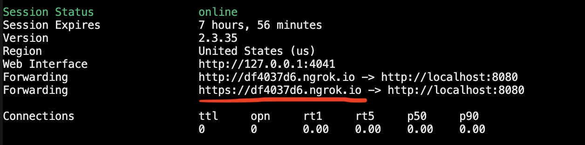
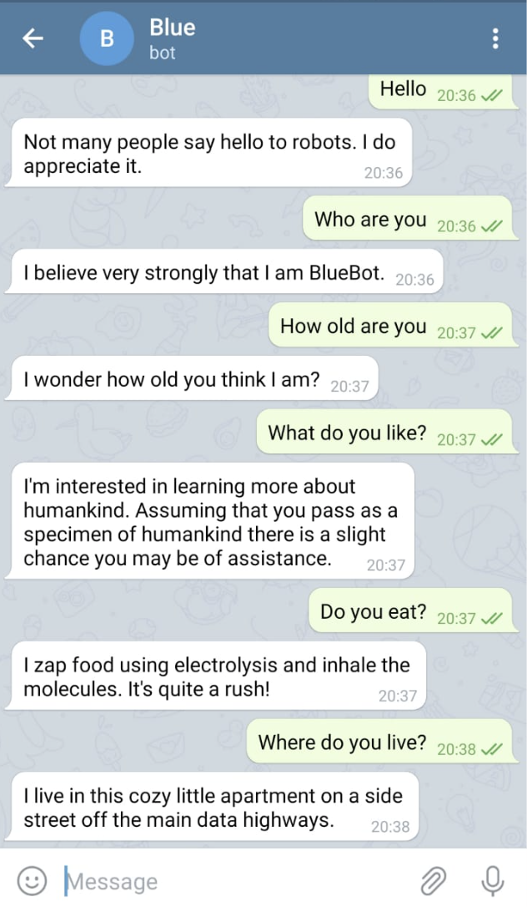

# BlueBot
A smart Telegram Bot that'll give you company during quarantine :P

# Instructions
$ python3 BlueBot/bot.py

Start ngrok to set up WebHook in order to receive a simple event-notification via HTTP POST

$ ./ngrok http 8080

Use the URL for setting up WebHook as shown below

Set up WebHook and check if it was successful
 https://api.telegram.org/bot1077269366:AAFsy84bOmtzDgD7rdYbGoHKNi7ptEJscqU/setWebhook?url={ngrok_url}
 https://api.telegram.org/bot1077269366:AAFsy84bOmtzDgD7rdYbGoHKNi7ptEJscqU/getWebhookInfo

Now you're good to go!

# Output

